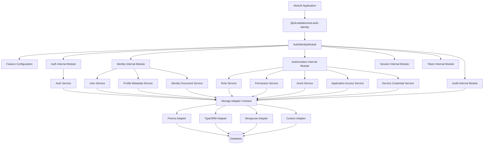
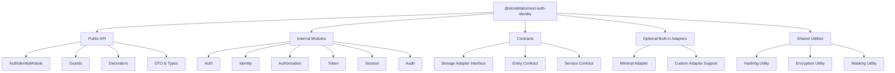
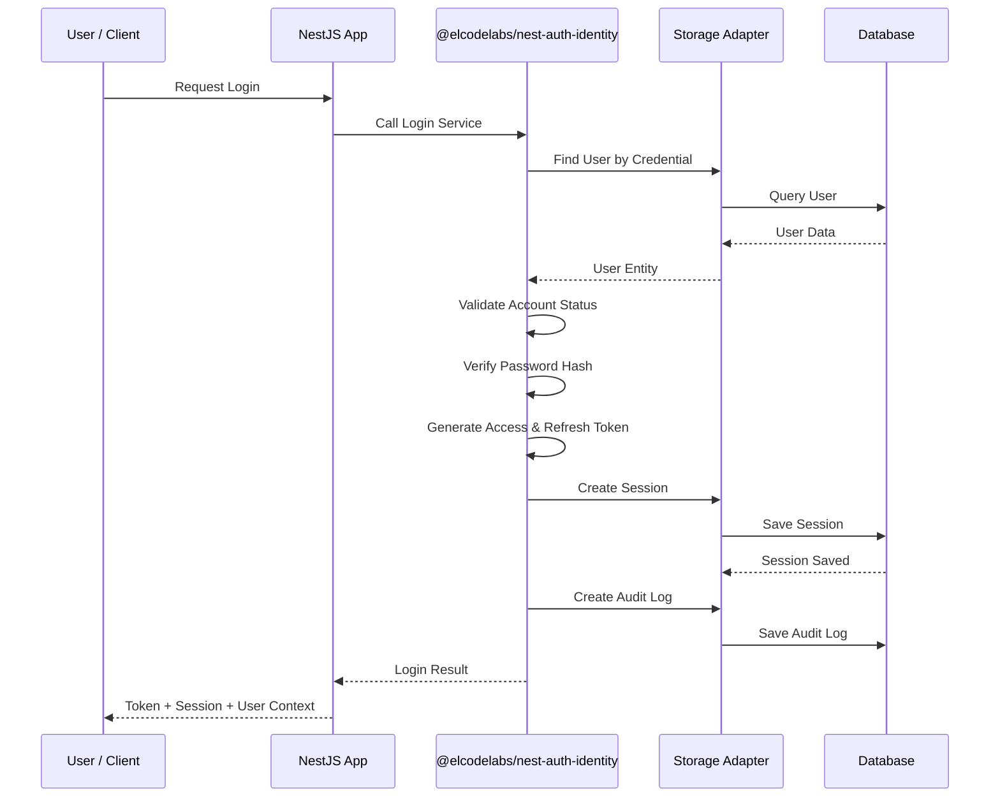
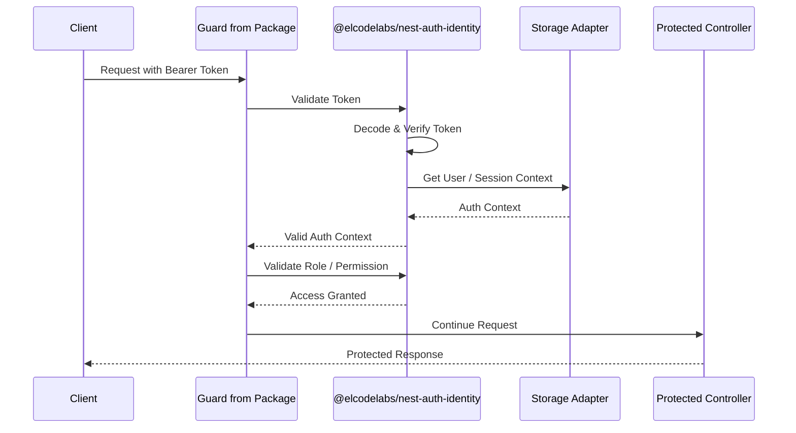
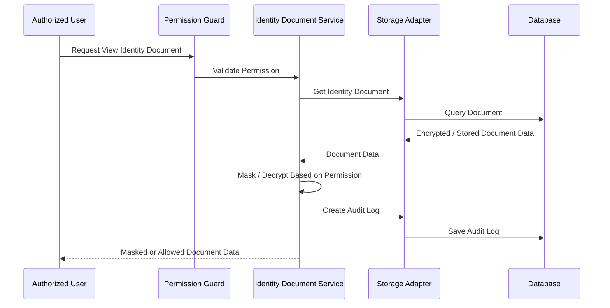
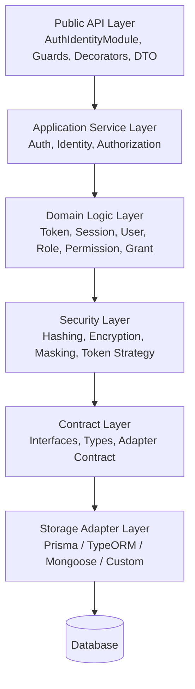

## 1. Overview

Auth & Identity Module adalah reusable NestJS module yang dikembangkan sebagai satu package utama bernama `@elcodelabs/nest-auth-identity`. Module ini berfungsi sebagai fondasi autentikasi, identitas pengguna, token, session, role, permission, grant, dan akses dasar aplikasi.

Module ini tidak dibuat untuk satu aplikasi tertentu, melainkan sebagai package internal yang dapat diinstall ke berbagai project NestJS melalui private Git repository. Dengan pendekatan ini, setiap aplikasi tidak perlu membangun sistem login dan identity management dari awal. Developer cukup memasang package, mengimport module, mengatur konfigurasi, lalu menggunakan fitur yang diperlukan sesuai kebutuhan aplikasi.

Untuk MVP, seluruh fitur berada dalam satu package yang sama, yaitu `@elcodelabs/nest-auth-identity`. Meskipun berada dalam satu package, struktur internal module tetap modular dan setiap fitur dapat diaktifkan atau dinonaktifkan melalui konfigurasi. Pemisahan menjadi package tambahan hanya dipertimbangkan di masa depan jika fitur tertentu sudah terlalu besar, memiliki dependency eksternal khusus, atau membutuhkan lifecycle pengembangan yang berbeda.

Module ini dirancang untuk digunakan pada berbagai jenis aplikasi seperti ERP, POS, SaaS, mobile backend, internal dashboard, company profile admin, maupun customer portal. Fitur yang tersedia mencakup register, login, logout, refresh token, validasi token, reset password, manajemen user, application access, role, permission, grant, session management, service credential, dan audit log.

Data utama yang dikelola oleh module meliputi user id, nama, username, email, nomor telepon, status akun, password hash, metode login, serta informasi verifikasi email dan nomor telepon. Untuk data profil tambahan seperti gender, alamat, avatar, telegram id, atau atribut lain yang berbeda-beda antar aplikasi, module menyediakan mekanisme profile metadata atau additional JSON agar tetap fleksibel.

Data penting yang sering dicari, difilter, atau membutuhkan unique constraint harus disimpan sebagai kolom utama. Metadata hanya digunakan untuk data tambahan yang opsional dan tidak selalu dibutuhkan oleh semua project.

Untuk data sensitif seperti NIK, nomor identitas resmi, NPWP, passport, atau dokumen verifikasi, module menyediakan struktur penyimpanan terpisah melalui identity documents. Data sensitif tidak boleh dicampurkan langsung ke metadata umum karena membutuhkan perlakuan keamanan khusus seperti enkripsi, masking, access control, dan audit log saat diakses atau diperbarui.

Flow besar penggunaan module:

`NestJS App → Install @elcodelabs/nest-auth-identity → Import AuthIdentityModule → Configure Features & Storage Adapter → Activate Needed Features → User Login/Register → Token & Session Created → Guard Validate Request → Protected Endpoint Access`

Dengan konsep storage adapter, core module tidak terikat pada satu ORM atau database tertentu. Core module hanya berisi logic authentication, identity, token, session, guard, decorator, service, dan interface contract. Penyimpanan data dilakukan melalui adapter seperti Prisma, TypeORM, Mongoose, atau custom adapter sesuai kebutuhan project.

## 2. Requirements

### 2.1 Business Requirements

* Module harus dikembangkan sebagai satu package utama untuk MVP, yaitu `@elcodelabs/nest-auth-identity`.
* Module harus dapat digunakan ulang di berbagai project NestJS.
* Module harus mengurangi kebutuhan membangun sistem login dan identity management dari awal pada setiap project.
* Module harus menyediakan standar authentication dan authorization yang konsisten.
* Module harus dapat digunakan untuk berbagai jenis aplikasi seperti ERP, POS, SaaS, mobile backend, internal dashboard, company profile admin, dan customer portal.
* Module harus bersifat configurable sehingga setiap aplikasi hanya mengaktifkan fitur yang dibutuhkan.
* Seluruh fitur MVP harus berada dalam package yang sama, tetapi modular secara internal.
* Module tidak boleh memaksa semua aplikasi menggunakan seluruh fitur.
* Module harus mendukung penyimpanan data melalui storage adapter agar tidak terikat pada satu ORM atau database.
* Module harus mendukung pengelolaan user identity, role, permission, grant, session, application access, service credential, dan audit log.
* Module harus dapat menyimpan data profil dasar sebagai kolom utama dan data profil tambahan sebagai metadata fleksibel.
* Module harus menyediakan pemisahan khusus untuk data sensitif seperti dokumen identitas legal.
* Module harus dapat berkembang dari reusable package sederhana menjadi fondasi identity untuk ekosistem modular atau microservice.
* Pemisahan package tambahan hanya boleh dipertimbangkan pada fase lanjutan jika fitur tertentu sudah terlalu besar atau membutuhkan dependency eksternal khusus.

### 2.2 Functional Requirements

* Developer dapat menginstall package `@elcodelabs/nest-auth-identity` melalui private Git repository.
* Developer dapat mengimport `AuthIdentityModule` ke dalam `AppModule`.
* Developer dapat mengatur konfigurasi JWT secret, token expiration, fitur aktif, dan storage adapter.
* Developer dapat memilih fitur yang ingin diaktifkan seperti authentication, session, role, permission, grant, audit log, identity document, metadata profile, application access, atau service credential.
* User dapat melakukan register jika fitur register diaktifkan.
* User dapat melakukan login menggunakan credential yang valid.
* Sistem dapat menghasilkan access token dan refresh token.
* Sistem dapat membuat session ketika login berhasil.
* Sistem dapat melakukan logout dan revoke session.
* Sistem dapat melakukan refresh token untuk memperbarui access token.
* Sistem dapat melakukan validasi token pada protected endpoint.
* Sistem menyediakan guard untuk melindungi endpoint.
* Sistem menyediakan decorator untuk mengambil user context.
* Sistem dapat melakukan validasi role dan permission.
* Sistem dapat mengelola data user dasar.
* Sistem dapat menyimpan profile metadata tambahan.
* Sistem dapat menyimpan dokumen identitas sensitif secara terpisah.
* Sistem dapat mengelola application access.
* Sistem dapat mengelola service credential untuk kebutuhan machine-to-machine authentication.
* Sistem dapat mencatat audit log untuk aktivitas penting.
* Sistem dapat menggunakan adapter Prisma, TypeORM, Mongoose, atau custom adapter.
* Sistem tetap dapat berjalan meskipun hanya sebagian fitur yang diaktifkan.

### 2.3 Non-Functional Requirements

* **Reusability:** Module harus reusable dan tidak mengandung logic bisnis spesifik aplikasi tertentu.
* **Single Package MVP:** Untuk MVP, seluruh fitur dikirim dalam satu package utama `@elcodelabs/nest-auth-identity`.
* **Internal Modularity:** Walaupun satu package, struktur internal harus dipisahkan berdasarkan domain fitur seperti auth, identity, authorization, session, token, audit, dan adapter.
* **Flexibility:** Fitur dapat diaktifkan atau dinonaktifkan melalui konfigurasi.
* **Scalability:** Struktur module harus mendukung perluasan fitur tanpa mengubah core besar-besaran.
* **Security:** Password harus disimpan dalam bentuk hash, token harus tervalidasi, session harus dapat dikontrol, dan data sensitif harus diproteksi.
* **Maintainability:** Codebase harus dipisahkan antara core logic, interface contract, storage adapter, DTO, guard, decorator, dan feature module.
* **Database Agnostic:** Core module tidak boleh bergantung langsung pada Prisma, TypeORM, Mongoose, PostgreSQL, MySQL, MongoDB, atau database tertentu.
* **Extensibility:** Aplikasi pengguna dapat membuat custom adapter, custom user metadata, custom policy, atau custom identity document type.
* **Performance:** Validasi authentication harus ringan dan tidak membebani request.
* **Auditability:** Aktivitas penting terkait akses, perubahan data sensitif, dan perubahan permission harus tercatat.
* **Backward Compatibility:** Perubahan package harus mempertimbangkan project yang sudah menggunakan versi sebelumnya.

### 2.4 MVP Scope

Fitur yang termasuk MVP dalam package `@elcodelabs/nest-auth-identity`:

1. Package installation via private Git repository.
2. Dynamic module configuration.
3. Feature toggle configuration.
4. JWT authentication.
5. Register.
6. Login.
7. Logout.
8. Refresh token.
9. Token validation.
10. Session management dasar.
11. User identity management dasar.
12. User profile metadata.
13. Identity document storage contract.
14. Auth guard.
15. Role guard.
16. Permission guard.
17. Current user decorator.
18. Role dan permission decorator.
19. Storage adapter contract.
20. Minimal storage adapter implementation.
21. Audit log dasar.
22. Basic application access.
23. Basic service credential contract.

Fitur lanjutan setelah MVP:

1. Pemisahan package tambahan jika diperlukan.
2. Advanced application access management.
3. Service credential management lengkap.
4. Advanced grant management.
5. Multi-tenant identity.
6. OAuth provider integration.
7. SSO.
8. MFA.
9. Device management.
10. Policy-based access control.
11. Centralized identity server.
12. Dedicated adapter package untuk ORM tertentu jika dependency terlalu besar.

## 3. Core Features

### 3.1 Single Package Distribution

Untuk MVP, module harus dikembangkan dan didistribusikan sebagai satu package utama:

`@elcodelabs/nest-auth-identity`

Seluruh fitur berada dalam package yang sama, termasuk:

* Authentication.
* Identity management.
* Token management.
* Session management.
* Role management.
* Permission management.
* Grant management.
* Application access.
* Service credential.
* Profile metadata.
* Identity documents.
* Audit log.
* Guard.
* Decorator.
* Storage adapter contract.

Business purpose:
Mempermudah instalasi, integrasi, versioning, dan maintenance pada fase MVP tanpa membuat developer harus mengelola banyak package sejak awal.

### 3.2 Internal Modular Architecture

Meskipun dikirim sebagai satu package, module harus modular secara internal.

Struktur internal minimal:

* `auth`
* `identity`
* `authorization`
* `token`
* `session`
* `profile`
* `identity-document`
* `application-access`
* `service-credential`
* `audit`
* `guards`
* `decorators`
* `contracts`
* `adapters`
* `common`

Business purpose:
Menjaga codebase tetap rapi, mudah dikembangkan, dan siap dipisah menjadi package tambahan jika dibutuhkan di masa depan.

### 3.3 Module Installation & Configuration

Developer dapat memasang package ke project NestJS melalui private Git repository, lalu mengimport `AuthIdentityModule` ke `AppModule`.

Konfigurasi minimal yang harus tersedia:

* JWT secret.
* Access token expiration.
* Refresh token expiration.
* Enabled features.
* Storage adapter.
* ID generation strategy, default auto increment dan dapat diubah ke UUID.
* ID source strategy, yaitu module-generated untuk development/simple app atau storage-generated untuk adapter database production.
* Password hashing configuration.
* Session strategy.
* Token strategy.
* Default user status.
* Default role jika dibutuhkan.
* Metadata configuration.
* Identity document configuration.
* Audit log configuration.

Business purpose:
Mempercepat setup authentication di project baru tanpa membuat ulang sistem identity dari awal.

### 3.4 Feature Toggle

Module harus menyediakan konfigurasi untuk mengaktifkan atau menonaktifkan fitur tertentu.

Contoh fitur yang dapat dikonfigurasi:

* Register.
* Login.
* Refresh token.
* Session management.
* Reset password.
* Role.
* Permission.
* Grant.
* Application access.
* Service credential.
* Audit log.
* Identity document.
* Profile metadata.

Business purpose:
Menjaga package tetap fleksibel dan ringan saat digunakan oleh aplikasi sederhana, tetapi tetap cukup lengkap untuk kebutuhan aplikasi yang lebih kompleks.

### 3.5 Authentication

Module harus menyediakan fitur authentication dasar.

Fitur utama:

* Register.
* Login.
* Logout.
* Refresh token.
* Validate token.
* Get current authenticated user.
* Reset password.
* Change password.

Login flow:

1. User mengirim credential.
2. Module memvalidasi credential.
3. Module mengambil user melalui storage adapter.
4. Module memverifikasi password hash.
5. Module membuat token.
6. Module membuat session.
7. Module mencatat audit log.
8. Module mengembalikan response login.

Business purpose:
Menyediakan akses aman dan konsisten untuk seluruh aplikasi yang menggunakan module.

### 3.6 Token Management

Module harus mengelola token authentication.

Fitur utama:

* Generate access token.
* Generate refresh token.
* Validate access token.
* Validate refresh token.
* Refresh token rotation jika diaktifkan.
* Revoke token.
* Token payload mapping.
* Token expiration handling.

Business purpose:
Memastikan user dapat mengakses aplikasi secara aman tanpa login ulang terus-menerus, sekaligus tetap dapat dikontrol melalui session dan revoke mechanism.

### 3.7 Session Management

Module harus menyediakan session management untuk melacak sesi login user.

Data session minimal:

* Session ID.
* User ID.
* Access token identifier.
* Refresh token hash.
* Device information.
* IP address.
* User agent.
* Expired at.
* Revoked at.
* Created at.
* Updated at.

Business purpose:
Memberikan kontrol terhadap sesi user, mendukung logout, audit keamanan, dan investigasi aktivitas mencurigakan.

### 3.8 User Identity Management

Module harus menyediakan pengelolaan identity dasar user.

Data utama user:

* User ID.
* Name.
* Username.
* Email.
* Phone number.
* Password hash.
* Account status.
* Login method.
* Email verified at.
* Phone verified at.
* Last login at.
* Created at.
* Updated at.

Fitur utama:

* Create user.
* Update user.
* Get user by ID.
* Get user by email.
* Get user by username.
* Get user by phone number.
* Activate user.
* Deactivate user.
* Change password.
* Reset password.

Business purpose:
Menyediakan struktur user dasar yang konsisten, mudah dicari, dan dapat digunakan lintas aplikasi.

### 3.9 Profile Metadata

Module harus mendukung penyimpanan data profil tambahan yang berbeda-beda antar aplikasi.

Contoh data metadata:

* Gender.
* Address.
* Avatar.
* Telegram ID.
* Birthdate.
* Custom attributes.
* External profile reference.

Aturan penggunaan metadata:

* Metadata digunakan untuk data opsional.
* Metadata digunakan untuk data yang tidak selalu ada di semua project.
* Metadata tidak digunakan untuk data yang sering dicari atau difilter.
* Metadata tidak digunakan untuk data yang membutuhkan unique constraint.
* Metadata tidak digunakan untuk data sensitif tingkat tinggi seperti NIK atau dokumen resmi.

Business purpose:
Menjaga struktur user tetap generic tanpa kehilangan fleksibilitas untuk kebutuhan aplikasi yang berbeda.

### 3.10 Identity Documents

Module harus menyediakan struktur terpisah untuk menyimpan data identitas sensitif.

Contoh data:

* NIK.
* Passport number.
* KTP document reference.
* NPWP.
* Business registration document.
* Verification document.
* Legal identity status.

Security requirement:

* Data sensitif harus dapat dienkripsi.
* Data sensitif harus dapat dimasking saat ditampilkan.
* Akses ke data sensitif harus dikontrol dengan permission khusus.
* Perubahan dan akses data sensitif harus dicatat dalam audit log.
* Raw document file sebaiknya disimpan di storage eksternal, sedangkan database menyimpan reference, hash, dan metadata file.

Business purpose:
Mendukung aplikasi yang membutuhkan identitas legal tanpa membuat struktur user utama terlalu berat atau terlalu spesifik.

### 3.11 Role Management

Module harus mendukung role-based access control.

Fitur utama:

* Create role.
* Update role.
* Delete role.
* Assign role to user.
* Remove role from user.
* Get roles by user.
* Validate role access.

Business purpose:
Memudahkan aplikasi mengelompokkan hak akses berdasarkan peran seperti admin, manager, staff, customer, atau service account.

### 3.12 Permission Management

Module harus mendukung permission-based access control.

Fitur utama:

* Create permission.
* Update permission.
* Delete permission.
* Assign permission to role.
* Remove permission from role.
* Assign direct permission to user.
* Validate permission pada endpoint.
* Resolve effective permission dari role dan direct permission.

Business purpose:
Memberikan kontrol akses yang lebih granular dibanding role saja.

### 3.13 Grant Management

Grant digunakan untuk memberikan akses tertentu kepada user, role, aplikasi, atau service credential.

Fitur utama:

* Create grant.
* Revoke grant.
* Check active grant.
* Expire grant.
* Validate grant scope.
* Assign grant to subject.

Business purpose:
Mendukung akses fleksibel seperti akses sementara, akses khusus aplikasi, atau akses service tertentu.

### 3.14 Application Access

Module harus dapat mendukung akses user terhadap aplikasi tertentu, terutama untuk ekosistem multi-app.

Fitur utama:

* Register application.
* Update application.
* Activate/deactivate application.
* Assign user access to application.
* Validate user access to application.
* Revoke application access.

Business purpose:
Memungkinkan satu identity foundation digunakan oleh beberapa aplikasi internal atau customer-facing.

### 3.15 Service Credential

Module harus mendukung service credential untuk kebutuhan machine-to-machine authentication.

Fitur utama:

* Create service credential.
* Generate client ID.
* Generate client secret.
* Hash client secret.
* Validate service credential.
* Assign scope atau permission.
* Revoke service credential.
* Rotate client secret.

Business purpose:
Mendukung integrasi antar service tanpa menggunakan akun user manusia.

### 3.16 Guard & Decorator

Module harus menyediakan guard dan decorator siap pakai.

Guard minimal:

* `JwtAuthGuard`.
* `SessionGuard`.
* `RoleGuard`.
* `PermissionGuard`.
* `GrantGuard`.

Decorator minimal:

* `@CurrentUser()`.
* `@CurrentUserId()`.
* `@AuthContext()`.
* `@Roles()`.
* `@Permissions()`.
* `@Grants()`.
* `@Public()`.

Business purpose:
Memudahkan developer melindungi endpoint tanpa menulis ulang logic authentication dan authorization.

### 3.17 Storage Adapter

Module harus menggunakan storage adapter agar core tidak bergantung pada database tertentu.

Adapter contract minimal:

* User storage adapter.
* Profile metadata storage adapter.
* Identity document storage adapter.
* Role storage adapter.
* Permission storage adapter.
* Session storage adapter.
* Token storage adapter.
* Grant storage adapter.
* Application access storage adapter.
* Service credential storage adapter.
* Audit log storage adapter.

Business purpose:
Membuat module dapat digunakan di berbagai project dengan database dan ORM berbeda tanpa memecah package MVP menjadi beberapa package.

### 3.18 Audit Log

Module harus mencatat aktivitas penting terkait authentication, authorization, identity, dan data sensitif.

Event minimal:

* Register.
* Login success.
* Login failed.
* Logout.
* Refresh token.
* Password reset request.
* Password changed.
* User status changed.
* Role assigned.
* Role removed.
* Permission assigned.
* Permission removed.
* Session revoked.
* Identity document created.
* Identity document viewed.
* Identity document updated.
* Identity document verified.
* Service credential created.
* Service credential used.
* Service credential revoked.

Business purpose:
Meningkatkan traceability, keamanan, dan kemudahan investigasi jika terjadi masalah akses atau penyalahgunaan data.

## 4. User Flow

### 4.1 Developer Integration Flow

1. Developer membuat project NestJS.
2. Developer menginstall package `@elcodelabs/nest-auth-identity` dari private Git repository.
3. Developer mengimport `AuthIdentityModule` ke `AppModule`.
4. Developer mengatur konfigurasi:

   * JWT secret.
   * Access token expiration.
   * Refresh token expiration.
   * Enabled features.
   * Storage adapter.
   * Password hashing.
   * Session strategy.
   * Metadata strategy.
   * Identity document strategy.
5. Developer menyiapkan adapter sesuai database project.
6. Developer menjalankan aplikasi.
7. Endpoint authentication tersedia sesuai fitur yang diaktifkan.
8. Developer menggunakan guard dan decorator pada endpoint aplikasi.
9. Aplikasi dapat menggunakan authentication, identity, dan authorization dari package yang sama.

### 4.2 Register Flow

1. User mengirim data register.
2. Module memvalidasi input register.
3. Module mengecek apakah email, username, atau nomor telepon sudah digunakan.
4. Module melakukan hash password.
5. Module menyimpan data user melalui storage adapter.
6. Module menyimpan profile metadata jika dikirim dan fitur metadata aktif.
7. Module mencatat audit log register.
8. Module mengembalikan response user created.

Failure scenario:

* Jika fitur register tidak aktif, sistem mengembalikan error feature disabled.
* Jika email, username, atau nomor telepon sudah digunakan, sistem mengembalikan error duplicate identity.
* Jika password tidak memenuhi policy, sistem mengembalikan error invalid password policy.
* Jika adapter gagal menyimpan data, sistem mengembalikan error storage failure.

### 4.3 Login Flow

1. User mengirim credential.
2. Module mencari user berdasarkan email, username, atau nomor telepon.
3. Module memvalidasi status user.
4. Module memverifikasi password.
5. Module membuat access token dan refresh token.
6. Module membuat session.
7. Module memperbarui last login.
8. Module mencatat audit log login success.
9. Module mengembalikan token, session info, dan user context.

Failure scenario:

* Jika credential salah, sistem mengembalikan error invalid credential.
* Jika user inactive, sistem mengembalikan error user inactive.
* Jika password salah, sistem mencatat audit log login failed.
* Jika session gagal dibuat, token tidak boleh dikembalikan ke client.

### 4.4 Protected Endpoint Flow

1. Client mengakses protected endpoint.
2. Request membawa access token.
3. Guard mengambil token dari header.
4. Module memvalidasi signature dan expiration token.
5. Module mengambil auth context.
6. Jika session validation aktif, module mengecek session.
7. Jika endpoint membutuhkan role, Role Guard memvalidasi role user.
8. Jika endpoint membutuhkan permission, Permission Guard memvalidasi permission user.
9. Jika valid, request diteruskan ke controller.
10. Jika tidak valid, sistem mengembalikan unauthorized atau forbidden.

### 4.5 Refresh Token Flow

1. User mengirim refresh token.
2. Module memvalidasi refresh token.
3. Module mengecek session terkait.
4. Module memastikan session masih aktif dan belum revoked.
5. Module membuat access token baru.
6. Jika refresh token rotation aktif, module membuat refresh token baru.
7. Module memperbarui token/session metadata.
8. Module mencatat audit log refresh token.
9. Module mengembalikan token baru.

Failure scenario:

* Jika refresh token invalid, sistem mengembalikan error refresh token invalid.
* Jika session revoked, sistem mengembalikan error session revoked.
* Jika session expired, sistem mengembalikan error session expired.

### 4.6 Logout Flow

1. User mengirim request logout.
2. Module memvalidasi token atau session.
3. Module melakukan revoke session.
4. Module melakukan revoke refresh token.
5. Module mencatat audit log logout.
6. Module mengembalikan response logout success.

### 4.7 User Profile Metadata Flow

1. Aplikasi mengirim update profile metadata.
2. Module memvalidasi apakah fitur metadata aktif.
3. Module memvalidasi struktur metadata sesuai konfigurasi jika schema disediakan.
4. Module menyimpan metadata melalui storage adapter.
5. Module mencatat audit log jika konfigurasi mengharuskan.
6. Module mengembalikan profile terbaru.

Failure scenario:

* Jika metadata berisi field sensitif yang tidak diperbolehkan, sistem menolak request.
* Jika metadata tidak sesuai schema konfigurasi, sistem mengembalikan validation error.

### 4.8 Identity Document Flow

1. User atau admin mengirim data dokumen identitas.
2. Module memvalidasi permission akses.
3. Module memvalidasi tipe dokumen.
4. Module melakukan masking atau encryption sesuai konfigurasi.
5. Module menyimpan data dokumen melalui storage adapter.
6. Module mencatat audit log identity document created atau updated.
7. Jika dokumen diakses, module mencatat audit log identity document viewed.
8. Module mengembalikan data dokumen dalam bentuk masked sesuai permission.

Failure scenario:

* Jika user tidak memiliki permission, sistem mengembalikan forbidden.
* Jika dokumen berisi data tidak valid, sistem mengembalikan validation error.
* Jika encryption gagal, sistem tidak boleh menyimpan data mentah.

### 4.9 Role & Permission Validation Flow

1. Developer menambahkan decorator role atau permission pada endpoint.
2. User mengakses endpoint.
3. Guard membaca metadata role atau permission dari endpoint.
4. Module mengambil role dan permission user.
5. Module menghitung effective permission.
6. Module membandingkan requirement endpoint dengan akses user.
7. Jika sesuai, request dilanjutkan.
8. Jika tidak sesuai, sistem mengembalikan forbidden.

### 4.10 Service Credential Flow

1. Service mengirim client ID dan client secret.
2. Module mencari service credential.
3. Module memverifikasi client secret hash.
4. Module mengecek status credential.
5. Module memvalidasi scope atau permission.
6. Module membuat service access token jika valid.
7. Module mencatat audit log service credential used.
8. Module mengembalikan token atau auth context service.

## 5. Architecture

### 5.1 High-Level Architecture

### 5.2 Package Boundary

### 5.3 Runtime Authentication Flow

### 5.4 Protected Request Flow

### 5.5 Identity Document Access Flow

### 5.6 Module Layering

### 5.7 Component Responsibility

| Komponen                         | Tanggung Jawab                                                                        |
| -------------------------------- | ------------------------------------------------------------------------------------- |
| `@elcodelabs/nest-auth-identity` | Package utama yang berisi seluruh fitur MVP                                           |
| `AuthIdentityModule`             | Entry point module untuk konfigurasi dan dependency injection                         |
| Feature Config                   | Menentukan fitur mana yang aktif pada aplikasi pengguna                               |
| Auth Internal Module             | Menangani register, login, logout, refresh token, dan reset password                  |
| Identity Internal Module         | Menangani user identity, profile metadata, dan identity document                      |
| Authorization Internal Module    | Menangani role, permission, grant, application access, dan service credential         |
| Token Service                    | Generate, verify, rotate, dan revoke token                                            |
| Session Service                  | Membuat, membaca, dan revoke session                                                  |
| Guard                            | Melindungi endpoint berdasarkan authentication, role, permission, grant, atau session |
| Decorator                        | Menyediakan metadata dan user context ke controller                                   |
| Storage Adapter Contract         | Interface standar untuk operasi persistence                                           |
| Storage Adapter Implementation   | Implementasi penyimpanan data sesuai ORM/database project                             |
| Audit Service                    | Mencatat event security dan identity penting                                          |
| Encryption/Masking Utility       | Melindungi data sensitif sebelum disimpan atau ditampilkan                            |

## 6. Database Schema

Schema berikut adalah referensi konseptual untuk adapter. Implementasi fisik dapat berbeda tergantung ORM dan database yang digunakan, tetapi struktur data utama harus tetap mendukung entity dan relasi berikut.

```mermaid
erDiagram
    users {
        string id PK
        string name
        string username
        string email
        string phone_number
        string password_hash
        string status
        string login_method
        datetime email_verified_at
        datetime phone_verified_at
        datetime last_login_at
        datetime created_at
        datetime updated_at
        datetime deleted_at
    }

    user_profiles {
        string id PK
        string user_id FK
        json metadata
        datetime created_at
        datetime updated_at
    }

    identity_documents {
        string id PK
        string user_id FK
        string document_type
        string document_number_hash
        string document_number_encrypted
        string document_number_masked
        string document_file_ref
        string verification_status
        datetime verified_at
        string verified_by
        datetime created_at
        datetime updated_at
    }

    roles {
        string id PK
        string code
        string name
        string description
        boolean is_system
        datetime created_at
        datetime updated_at
    }

    permissions {
        string id PK
        string code
        string name
        string description
        string resource
        string action
        datetime created_at
        datetime updated_at
    }

    user_roles {
        string id PK
        string user_id FK
        string role_id FK
        datetime assigned_at
        string assigned_by
    }

    role_permissions {
        string id PK
        string role_id FK
        string permission_id FK
        datetime assigned_at
        string assigned_by
    }

    user_permissions {
        string id PK
        string user_id FK
        string permission_id FK
        datetime assigned_at
        datetime expired_at
        string assigned_by
    }

    sessions {
        string id PK
        string user_id FK
        string access_token_id
        string refresh_token_hash
        string device_info
        string ip_address
        string user_agent
        datetime expired_at
        datetime revoked_at
        datetime created_at
        datetime updated_at
    }

    grants {
        string id PK
        string subject_type
        string subject_id
        string resource
        string action
        string scope
        datetime expired_at
        datetime revoked_at
        datetime created_at
    }

    applications {
        string id PK
        string code
        string name
        string description
        boolean is_active
        datetime created_at
        datetime updated_at
    }

    application_users {
        string id PK
        string application_id FK
        string user_id FK
        string status
        datetime granted_at
        datetime revoked_at
    }

    service_credentials {
        string id PK
        string application_id FK
        string client_id
        string client_secret_hash
        string name
        string status
        datetime expired_at
        datetime revoked_at
        datetime created_at
    }

    audit_logs {
        string id PK
        string actor_type
        string actor_id
        string event
        string resource
        string resource_id
        string ip_address
        string user_agent
        json metadata
        datetime created_at
    }

    users ||--o| user_profiles : "has profile metadata"
    users ||--o{ identity_documents : "has sensitive documents"
    users ||--o{ user_roles : "has roles"
    roles ||--o{ user_roles : "assigned to users"
    roles ||--o{ role_permissions : "has permissions"
    permissions ||--o{ role_permissions : "assigned to roles"
    users ||--o{ user_permissions : "has direct permissions"
    permissions ||--o{ user_permissions : "assigned directly"
    users ||--o{ sessions : "has sessions"
    users ||--o{ application_users : "access applications"
    applications ||--o{ application_users : "has users"
    applications ||--o{ service_credentials : "has credentials"
```

### 6.1 Table Explanation

| Tabel                 | Deskripsi                                                                                                                                  |
| --------------------- | ------------------------------------------------------------------------------------------------------------------------------------------ |
| `users`               | Menyimpan identitas dasar user seperti nama, username, email, nomor telepon, password hash, status akun, metode login, dan data verifikasi |
| `user_profiles`       | Menyimpan metadata tambahan profil user dalam format JSON untuk kebutuhan aplikasi yang berbeda-beda                                       |
| `identity_documents`  | Menyimpan data identitas sensitif seperti NIK, passport, NPWP, atau dokumen verifikasi dengan proteksi khusus                              |
| `roles`               | Menyimpan daftar role yang dapat diberikan ke user                                                                                         |
| `permissions`         | Menyimpan daftar permission granular berdasarkan resource dan action                                                                       |
| `user_roles`          | Relasi many-to-many antara user dan role                                                                                                   |
| `role_permissions`    | Relasi many-to-many antara role dan permission                                                                                             |
| `user_permissions`    | Permission langsung ke user untuk kebutuhan exception atau akses sementara                                                                 |
| `sessions`            | Menyimpan session login user, refresh token hash, device info, IP, user agent, dan status revoke                                           |
| `grants`              | Menyimpan akses khusus berbasis subject, resource, action, scope, dan expiration                                                           |
| `applications`        | Menyimpan daftar aplikasi yang dapat menggunakan identity foundation                                                                       |
| `application_users`   | Menyimpan akses user terhadap aplikasi tertentu                                                                                            |
| `service_credentials` | Menyimpan credential untuk machine-to-machine authentication                                                                               |
| `audit_logs`          | Menyimpan log aktivitas penting terkait authentication, authorization, identity, dan akses data sensitif                                   |

### 6.2 Main Column vs Metadata Rules

Data yang sebaiknya menjadi kolom utama:

* User ID.
* Name.
* Username.
* Email.
* Phone number.
* Password hash.
* Status.
* Login method.
* Email verification status.
* Phone verification status.
* Last login.

Alasan:
Data ini sering digunakan untuk login, pencarian, filter, unique constraint, audit, dan authorization context.

Data yang dapat masuk ke metadata:

* Gender.
* Avatar.
* Address.
* Telegram ID.
* Birthdate.
* Social profile reference.
* Custom application-specific attributes.

Alasan:
Data ini bersifat opsional, tidak selalu digunakan di semua project, dan dapat berbeda-beda antar aplikasi.

Data yang tidak boleh masuk ke metadata umum:

* NIK.
* Passport number.
* NPWP.
* Nomor dokumen legal.
* Raw document file.
* Data verifikasi identitas resmi.
* Data sensitif yang membutuhkan encryption, masking, atau audit khusus.

Alasan:
Data tersebut membutuhkan proteksi lebih tinggi dan harus disimpan melalui struktur `identity_documents`.

### 6.3 Adapter Contract Notes

Core module tidak boleh melakukan query database langsung. Seluruh operasi persistence harus melalui adapter contract.

Contract minimal:

* `UserStorageAdapter`
* `UserProfileStorageAdapter`
* `IdentityDocumentStorageAdapter`
* `RoleStorageAdapter`
* `PermissionStorageAdapter`
* `SessionStorageAdapter`
* `TokenStorageAdapter`
* `GrantStorageAdapter`
* `ApplicationAccessStorageAdapter`
* `ServiceCredentialStorageAdapter`
* `AuditLogStorageAdapter`

Setiap adapter harus menangani mapping antara entity internal module dan schema database project.

### 6.4 Data Validation Rules

* Email harus unik jika digunakan sebagai identifier.
* Username harus unik jika digunakan sebagai identifier.
* Nomor telepon harus unik jika digunakan sebagai identifier.
* Password tidak boleh disimpan dalam bentuk plain text.
* Refresh token harus disimpan dalam bentuk hash.
* Session yang revoked tidak boleh digunakan untuk refresh token.
* Role code harus unik.
* Permission code harus unik.
* Client secret service credential harus disimpan dalam bentuk hash.
* Metadata tidak boleh menyimpan password, raw token, client secret, atau dokumen sensitif.
* Identity document number harus disimpan dalam bentuk encrypted atau hash sesuai kebutuhan pencarian.
* Identity document harus memiliki masked value untuk kebutuhan display aman.
* Audit log tidak boleh mengandung password, secret, raw token, atau raw document value.

## 7. Design & Technical Constraints

### 7.1 Package Constraint

* Untuk MVP, module dikembangkan sebagai satu package utama bernama `@elcodelabs/nest-auth-identity`.
* Seluruh fitur MVP harus berada dalam satu package yang sama.
* Package tetap harus modular secara internal berdasarkan domain fitur.
* Fitur harus dapat diaktifkan atau dinonaktifkan melalui konfigurasi.
* Pemisahan package tambahan tidak dilakukan pada MVP.
* Pemisahan package tambahan hanya dipertimbangkan di masa depan jika:

  * fitur tertentu sudah terlalu besar,
  * fitur memiliki dependency eksternal khusus,
  * adapter ORM tertentu membuat package utama terlalu berat,
  * fitur membutuhkan lifecycle release yang berbeda,
  * atau kebutuhan pengguna package sudah jelas terpisah.
* Public API package harus stabil dan tidak berubah tanpa versioning yang jelas.

### 7.2 Technical Stack

* Module dibangun menggunakan NestJS.
* Module dikembangkan sebagai reusable package.
* Distribusi package dilakukan melalui private Git repository.
* Core module menggunakan TypeScript.
* Module harus kompatibel dengan dependency injection NestJS.
* Module harus mendukung dynamic module pattern seperti `forRoot` dan `forRootAsync`.
* Module tidak boleh bergantung langsung pada satu ORM atau database.
* Adapter dapat dibuat untuk Prisma, TypeORM, Mongoose, atau custom implementation.
* ID utama seperti user id harus mendukung strategi default auto increment, tetapi dapat dikonfigurasi menjadi UUID sesuai kebutuhan project.
* Nilai ID pada contract module direpresentasikan konsisten sebagai string agar adapter dapat memetakan integer auto increment, UUID, atau format database lain tanpa mengubah public API.
* Adapter production harus dapat mengabaikan ID dari module dan mengembalikan ID final yang dibuat oleh database jika menggunakan auto increment database.

### 7.3 Module Design Constraints

* Core module hanya boleh berisi authentication logic, identity logic, authorization logic, token logic, session logic, guard, decorator, DTO, interface, dan service contract.
* Logic penyimpanan data harus berada di adapter.
* Module tidak boleh membawa domain bisnis spesifik seperti sales, inventory, finance, product, order, warehouse, atau customer transaction.
* Fitur harus dapat diaktifkan atau dinonaktifkan melalui konfigurasi.
* Fitur yang tidak aktif tidak boleh memaksa aplikasi membuat table atau dependency yang tidak digunakan.
* Public API module harus stabil agar tidak mudah merusak project pengguna.
* Error response harus konsisten dan dapat dipetakan oleh aplikasi pengguna.
* Data user utama harus tetap generic.
* Data tambahan harus disimpan melalui metadata.
* Data sensitif harus disimpan melalui struktur khusus, bukan metadata umum.
* Internal module boleh dipisahkan secara folder dan provider, tetapi tetap berada dalam satu package untuk MVP.

### 7.4 Security Constraints

* Password wajib menggunakan hashing yang aman.
* Secret tidak boleh hardcoded di dalam module.
* JWT secret harus berasal dari konfigurasi aplikasi pengguna.
* Access token harus memiliki expiration.
* Refresh token harus dapat direvoke.
* Refresh token harus disimpan dalam bentuk hash.
* Logout harus dapat menginvalidasi session.
* Guard harus menolak token expired, invalid, malformed, atau revoked.
* Permission validation harus default deny jika user context tidak tersedia.
* Identity document harus dienkripsi atau di-hash sesuai jenis data.
* Identity document harus ditampilkan dalam bentuk masked secara default.
* Akses identity document harus membutuhkan permission khusus.
* Akses dan perubahan identity document harus tercatat di audit log.
* Audit log tidak boleh menyimpan password, raw token, raw client secret, atau raw identity document value.

### 7.5 API Design Constraints

Endpoint yang disediakan module harus dapat diaktifkan sesuai konfigurasi.

Endpoint authentication MVP:

| Method | Endpoint                | Deskripsi                       |
| ------ | ----------------------- | ------------------------------- |
| `POST` | `/auth/register`        | Register user baru              |
| `POST` | `/auth/login`           | Login user                      |
| `POST` | `/auth/logout`          | Logout user                     |
| `POST` | `/auth/refresh`         | Refresh access token            |
| `GET`  | `/auth/me`              | Mengambil user context saat ini |
| `POST` | `/auth/validate`        | Validasi token                  |
| `POST` | `/auth/password/forgot` | Request reset password          |
| `POST` | `/auth/password/reset`  | Reset password                  |
| `POST` | `/auth/password/change` | Change password                 |

Endpoint identity opsional:

| Method  | Endpoint                         | Deskripsi                |
| ------- | -------------------------------- | ------------------------ |
| `GET`   | `/identity/users`                | List user                |
| `GET`   | `/identity/users/:id`            | Detail user              |
| `PATCH` | `/identity/users/:id`            | Update user              |
| `PATCH` | `/identity/users/:id/status`     | Update status user       |
| `GET`   | `/identity/users/:id/profile`    | Get profile metadata     |
| `PATCH` | `/identity/users/:id/profile`    | Update profile metadata  |
| `GET`   | `/identity/users/:id/documents`  | List identity documents  |
| `POST`  | `/identity/users/:id/documents`  | Create identity document |
| `GET`   | `/identity/documents/:id`        | Detail identity document |
| `PATCH` | `/identity/documents/:id`        | Update identity document |
| `PATCH` | `/identity/documents/:id/verify` | Verify identity document |

Endpoint authorization opsional:

| Method   | Endpoint                                        | Deskripsi                   |
| -------- | ----------------------------------------------- | --------------------------- |
| `GET`    | `/identity/roles`                               | List role                   |
| `POST`   | `/identity/roles`                               | Create role                 |
| `PATCH`  | `/identity/roles/:id`                           | Update role                 |
| `DELETE` | `/identity/roles/:id`                           | Delete role                 |
| `GET`    | `/identity/permissions`                         | List permission             |
| `POST`   | `/identity/permissions`                         | Create permission           |
| `PATCH`  | `/identity/permissions/:id`                     | Update permission           |
| `POST`   | `/identity/users/:id/roles`                     | Assign role to user         |
| `DELETE` | `/identity/users/:id/roles/:roleId`             | Remove role from user       |
| `POST`   | `/identity/roles/:id/permissions`               | Assign permission to role   |
| `DELETE` | `/identity/roles/:id/permissions/:permissionId` | Remove permission from role |
| `GET`    | `/identity/audit-logs`                          | List audit log              |

### 7.6 Error Handling Constraints

Error minimal yang harus distandardisasi:

| Error Code                                    | Kondisi                                                |
| --------------------------------------------- | ------------------------------------------------------ |
| `AUTH_FEATURE_DISABLED`                       | Fitur yang dipanggil tidak aktif                       |
| `AUTH_INVALID_CREDENTIAL`                     | Credential login salah                                 |
| `AUTH_USER_INACTIVE`                          | User tidak aktif                                       |
| `AUTH_TOKEN_EXPIRED`                          | Token sudah expired                                    |
| `AUTH_TOKEN_INVALID`                          | Token tidak valid                                      |
| `AUTH_SESSION_REVOKED`                        | Session sudah revoked                                  |
| `AUTH_REFRESH_TOKEN_INVALID`                  | Refresh token tidak valid                              |
| `AUTH_FORBIDDEN_ROLE`                         | User tidak memiliki role yang dibutuhkan               |
| `AUTH_FORBIDDEN_PERMISSION`                   | User tidak memiliki permission yang dibutuhkan         |
| `AUTH_STORAGE_ERROR`                          | Adapter gagal melakukan operasi storage                |
| `AUTH_DUPLICATE_IDENTITY`                     | Email, username, atau nomor telepon sudah digunakan    |
| `AUTH_INVALID_PASSWORD_POLICY`                | Password tidak sesuai policy                           |
| `AUTH_METADATA_INVALID`                       | Profile metadata tidak sesuai aturan                   |
| `AUTH_SENSITIVE_DATA_NOT_ALLOWED_IN_METADATA` | Metadata berisi data sensitif yang tidak diperbolehkan |
| `AUTH_IDENTITY_DOCUMENT_FORBIDDEN`            | User tidak memiliki akses ke identity document         |
| `AUTH_IDENTITY_DOCUMENT_INVALID`              | Data dokumen identitas tidak valid                     |
| `AUTH_ENCRYPTION_FAILED`                      | Proses enkripsi data sensitif gagal                    |
| `AUTH_PACKAGE_CONFIG_INVALID`                 | Konfigurasi package tidak valid                        |
| `AUTH_ADAPTER_NOT_CONFIGURED`                 | Storage adapter belum dikonfigurasi                    |

### 7.7 Performance Constraints

* Validasi token harus ringan dan tidak selalu membutuhkan query database jika konfigurasi stateless JWT digunakan.
* Jika session validation aktif, query session harus dioptimalkan melalui index pada `user_id`, `refresh_token_hash`, `revoked_at`, dan `expired_at`.
* Permission resolution harus dapat di-cache pada level aplikasi jika dibutuhkan.
* Metadata profile tidak boleh digunakan sebagai basis query utama untuk data yang sering difilter.
* Identity document tidak boleh didekripsi tanpa kebutuhan yang valid.
* Audit log tidak boleh menghambat response utama jika dapat diproses secara asynchronous oleh aplikasi pengguna.
* Module harus tetap efisien untuk aplikasi kecil yang hanya membutuhkan login dan JWT.
* Karena MVP berada dalam satu package, dependency eksternal harus dijaga seminimal mungkin agar package tidak terlalu berat.

### 7.8 Scalability Constraints

* Module harus dapat digunakan pada aplikasi sederhana maupun ekosistem multi-application.
* Adapter contract harus mendukung implementasi untuk SQL dan NoSQL.
* Token strategy harus mendukung stateless dan session-backed authentication.
* Role dan permission harus dapat diperluas tanpa mengubah struktur core besar-besaran.
* Metadata profile harus mendukung custom attribute tanpa migration besar untuk setiap project.
* Identity document harus dapat diperluas untuk berbagai tipe dokumen.
* Service credential dan application access harus dapat ditambahkan tanpa mengganggu authentication dasar.
* Struktur folder internal harus disiapkan agar fitur dapat dipisahkan menjadi package tersendiri di masa depan jika diperlukan.

### 7.9 Documentation Requirements

Module harus memiliki dokumentasi minimal:

* Cara instalasi package `@elcodelabs/nest-auth-identity`.
* Cara import `AuthIdentityModule`.
* Contoh konfigurasi basic JWT.
* Contoh konfigurasi enabled features.
* Contoh implementasi storage adapter.
* Contoh penggunaan guard.
* Contoh penggunaan decorator.
* Contoh role dan permission.
* Contoh penggunaan profile metadata.
* Contoh penyimpanan identity document.
* Panduan handling data sensitif.
* Daftar endpoint.
* Daftar error code.
* Panduan internal modular structure.
* Migration guide jika ada breaking changes.
* Panduan kapan fitur layak dipisahkan menjadi package tambahan di masa depan.

### 7.10 MVP Boundary

Untuk MVP, module tidak wajib menyediakan:

* UI admin.
* SSO.
* OAuth login provider.
* MFA.
* Biometric authentication.
* Advanced policy engine.
* Full multi-tenant isolation.
* Event bus lintas service.
* Centralized identity server terpisah.
* File storage bawaan untuk dokumen.
* OCR dokumen identitas.
* Verifikasi legal otomatis ke pihak ketiga.
* Package terpisah untuk setiap fitur.
* Package adapter terpisah untuk setiap ORM.

Fokus MVP adalah reusable authentication dan identity foundation dalam satu package utama `@elcodelabs/nest-auth-identity` yang stabil, ringan, mudah dipasang, database agnostic, modular secara internal, dapat dikonfigurasi per fitur, mendukung profile metadata, serta memiliki struktur aman untuk data identitas sensitif.
